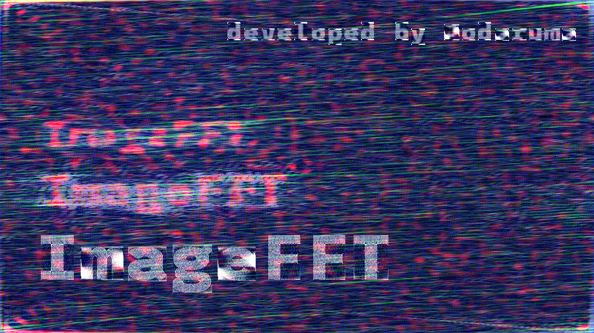
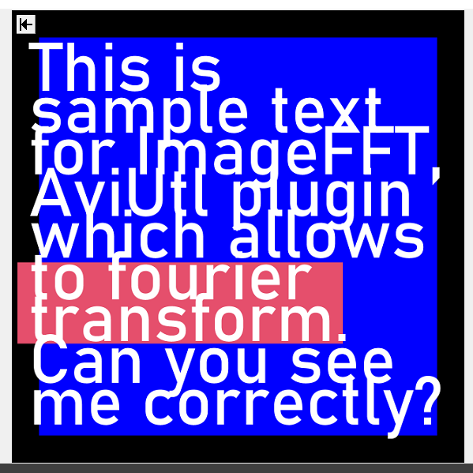
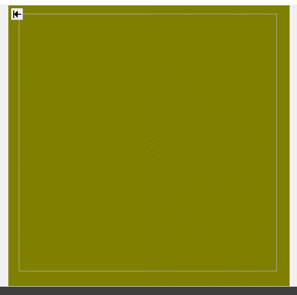
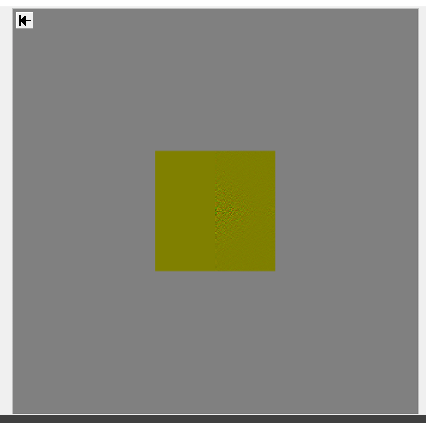
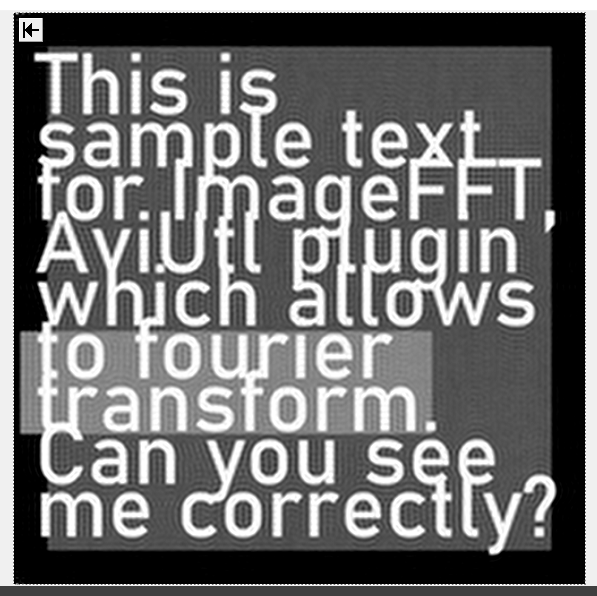
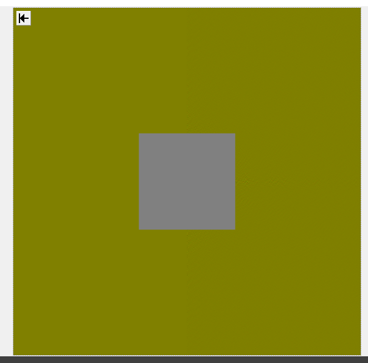
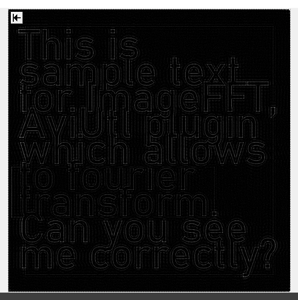
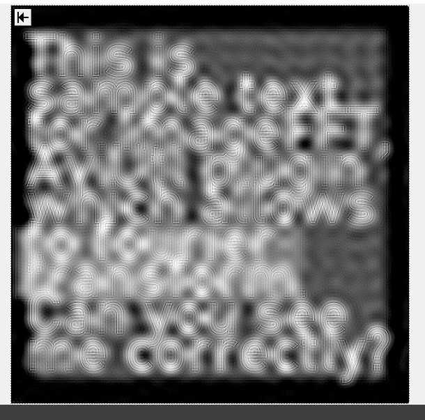
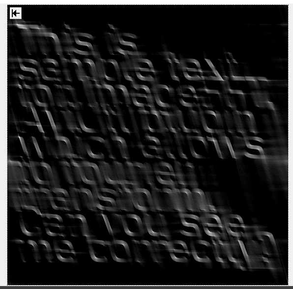
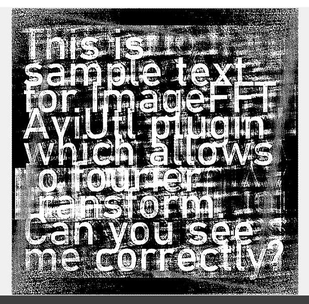

# ImageFFT

画像の高速フーリエ変換(FFT)・高速逆フーリエ変換(IFFT)を行うプラグインです。

現在は **version 1.0** が最新です。

## FFT@ImageFFT

以下はパラメーターの説明です。

-   **トラックバー・チェックボックス**
    -   Channel: FFT を実行する画像チャンネル [All, Mono, Red, Green, Blue, Alpha]
    -   Re<->Im: 出力する画像の実部・虚部切り替え（Channel == "All"のみ有効; その他では R で実部・G で虚部を出力します。）
    -   SwapQ: 周波数成分の象限入れ替えを行うかどうか
    -   OutCurve: 出力値に対する変換の種類 [Linear, Log2]
    -   Enable: FFT を実行するかどうか
    -   ShowHelp: ヘルプを表示するかどうか

## IFFT@ImageFFT

以下はパラメーターの説明です。

-   **トラックバー・チェックボックス**
    -   Channel: IFFT の実行結果の出力先画像チャンネル [All, Mono, Red, Green, Blue, Alpha]
    -   Re<->Im: 入力する画像が実部・虚部いずれか（Channel == \"All\"のみ有効; その他では R で実部・G で虚部としてロードします。
    -   SwapQ:　周波数成分の象限入れ替えを行うかどうか
    -   InCurve: 入力値に対する変換の種類 [Linear, Log2]
    -   Enable: IFFT を実行するかどうか
    -   ShowHelp: ヘルプを表示するかどうか

---

## tips

FFT@ImageFFT で出力される画像は、(Channel != 0 の場合) 実部と虚部をそれぞれ Red, Green に格納しています。値は 0 から 255 に正規化されており、それぞれ 128 を基準値としています。

ローパスフィルタとして使用する場合、以下のような手順で行うことができます。

1. FFT@ImageFFT で、SwapQ を有効にした状態でフーリエ変換を行う。
1. ` 図形 → 背景`から(128, 128, 128)の背景色を持つ背景画像を、一つ後のレイヤーに作成する。
1. 背景画像に対してエフェクト`マスク`を使用し、`マスクの反転`を有効にする。また、マスクの種類やサイズを適当な大きさにする。
1. フレームバッファを使用し、IFFT@ImageFFT により逆フーリエ変換を行う。

これにより、元画像の低周波成分のみを抽出することができます。（より中央に近い部分のみを抽出することで、より低周波な成分のみを抽出することができます。）

また、`マスクの反転`を無効にすることで、高周波成分のみを抽出することも可能です。（ハイパスフィルタ）

FFT によって得られた周波数成分の画像を編集することにより、様々な画像処理を行うことができます。是非色々と試してみてください。

---

## 導入方法 / how to install

[こちらのリポジトリ](https://github.com/Aodaruma/Aodaruma-AviUtl-Script)を参照してください。

## ライセンス / Licence

[こちらのリポジトリ](https://github.com/Aodaruma/Aodaruma-AviUtl-Script)を参照してください。
